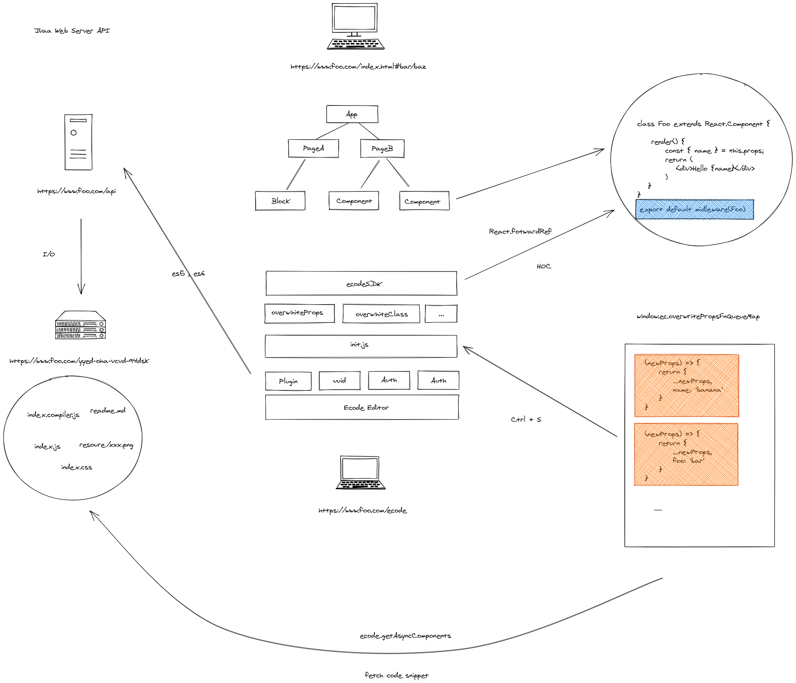

## Tiny Procode

⚡ A procode solution for SPA (Single Page Application)



### Step 1

Add the **midleware** for your Button in UI library:

```ts
function Button() {
  // ...
}

export default midleware(Button);
```

### Step 2

Write the code snippet in **customize.js** with the online web editor ([monaco-editor](https://github.com/microsoft/monaco-editor)):

```js
window.pcComponentsConfig = {
  Button: {
    /**
     * Rewrite the component and just replace some props.
     */
    rewriteFn: (newProps) => {
      // Todo ...
      
      return newProps
    },
    /**
     * Refactor the component and make a great change.
     */
    refactorFn: (newCom, newProps) => {
      // Todo ...
      
      return {
        com: newCom,
        props: newProps
      };
    }
  }
};
```

### Step 3

Added the **@babel/standalone** at index.html and reload the browser to fetch the new version of **customize.js**.

```html
<script crossorigin src="https://cdn.jsdelivr.net/npm/@babel/standalone/babel.min.js"></script>
<script type="text/babel" src="%PUBLIC_URL%/customize.js"></script>
```

[](https://codesandbox.io/s/focused-morning-ssyg5?fontsize=14&hidenavigation=1&theme=dark)
